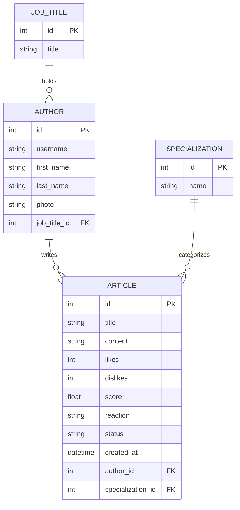

# Article Feature — Data Diagram (ER)

```mermaid
erDiagram
    ARTICLE {
        int id PK
        string title
        string content
        int likes
        int dislikes
        float score
        string reaction
        string status
        datetime created_at
        int author_id FK
        int specialization_id FK
    }
    AUTHOR {
        int id PK
        string username
        string first_name
        string last_name
        string photo
        int job_title_id FK
    }
    SPECIALIZATION {
        int id PK
        string name
    }
    JOB_TITLE {
        int id PK
        string title
    }

    AUTHOR ||--o{ ARTICLE : writes
    SPECIALIZATION ||--o{ ARTICLE : categorizes
    JOB_TITLE ||--o{ AUTHOR : holds
```

This diagram represents the server-side entities reflected in the client models.
