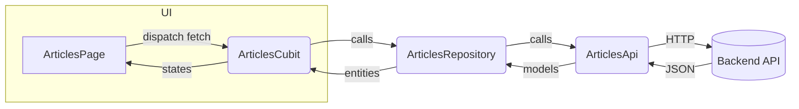

# Article Feature — Data Flow

Notes:
- The UI dispatches events to the Cubit, which orchestrates repository calls.
- Repository maps API models to domain entities and centralizes errors.
- API layer is responsible for HTTP status mapping and conversion to models.
