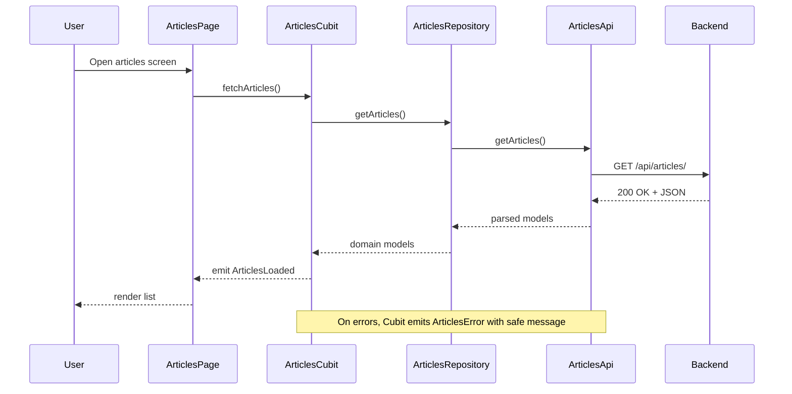

# Article Feature — Flow Diagram (Sequence)

```mermaid
sequenceDiagram
    participant U as User
    participant UI as ArticlesPage
    participant C as ArticlesCubit
    participant R as ArticlesRepository
    participant API as ArticlesApi
    participant S as Backend

    U->>UI: Open articles screen
    UI->>C: fetchArticles()
    C->>R: getArticles()
    R->>API: getArticles()
    API->>S: GET /api/articles/
    S-->>API: 200 OK + JSON
    API-->>R: parsed models
    R-->>C: domain models
    C-->>UI: emit ArticlesLoaded
    UI-->>U: render list

    Note over C,API: On errors, Cubit emits ArticlesError with safe message
```
